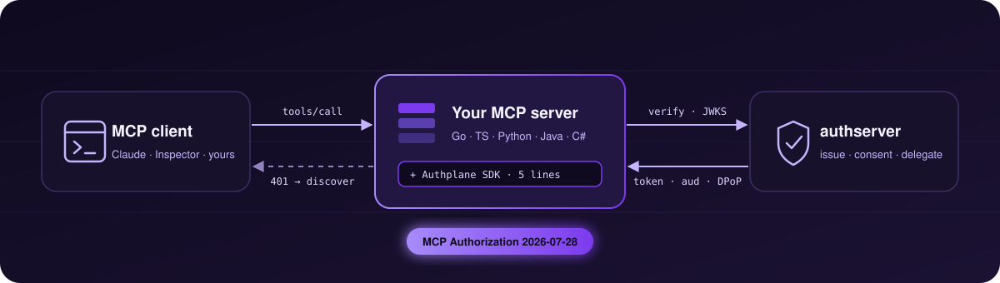

<h1 align="center">Authplane</h1>

<p align="center"><strong>Open-source OAuth 2.1 + MCP authorization, self-hosted.</strong></p>

<p align="center">
  <a href="https://github.com/AuthPlane/authserver"></a>
  <a href="https://github.com/AuthPlane/authserver/blob/main/LICENSE"></a>
  <a href="https://github.com/AuthPlane/go-sdk/blob/main/LICENSE"></a>
  <a href="https://modelcontextprotocol.io"></a>
  <a href="mailto:hello@authplane.ai"></a>
</p>

---

<p align="center"></p>

Building an MCP server is a one-afternoon job. Securing it isn't: you need to issue tokens, validate them, federate to the IdP you already have, and let agents act on each other's behalf without losing the user behind the chain. **Authplane is the one piece of infrastructure that answers all of that.** **authserver** issues audience-bound, DPoP-capable tokens and owns discovery, registration, consent and delegation. The **SDK** you embed in your MCP server — five lines, in your language — verifies those tokens, serves Protected Resource Metadata, and enforces scopes per tool. The **conformance** catalog is the test suite both sides run against, so a server and an SDK in different languages agree on every byte.

## Repositories

| Repo | What it is | Language | Status | License |
|---|---|---|---|---|
| **[authserver](https://github.com/AuthPlane/authserver)** | Self-hosted OAuth 2.1 + MCP Authorization server. One Go binary, embedded Admin UI, PostgreSQL + Vault-backed signing for production. | Go | `v0.2.0` — MCP Authorization 2026-07-28 | **AGPL-3.0** |
| **[go-sdk](https://github.com/AuthPlane/go-sdk)** | Resource-server SDK and OAuth client for Go. Adapters for the official MCP Go SDK, [`mark3labs/mcp-go`](https://github.com/mark3labs/mcp-go), and `net/http`. | Go | `v0.3.0` | Apache-2.0 |
| **[ts-sdk](https://github.com/AuthPlane/ts-sdk)** | Resource-server SDK and OAuth client for TypeScript. Adapters for the official MCP TS SDK, FastMCP, Hono, and NestJS. | TypeScript | `v0.4.0` | Apache-2.0 |
| **[python-sdk](https://github.com/AuthPlane/python-sdk)** | Resource-server SDK and OAuth client for Python. Adapters for the official MCP Python SDK and FastMCP. | Python | `v0.4.0` | Apache-2.0 |
| **[java-sdk](https://github.com/AuthPlane/java-sdk)** | Resource-server SDK and OAuth client for Java. Adapters for the official MCP Java SDK and Spring Boot / Spring Security. On Maven Central as `ai.authplane.sdk`. | Java | `v0.2.0` | Apache-2.0 |
| **[cs-sdk](https://github.com/AuthPlane/cs-sdk)** | Resource-server SDK and OAuth client for C# / .NET. Adapter for the official MCP C# SDK on ASP.NET Core. On NuGet as `Authplane.Sdk` / `Authplane.Mcp`. | C# | `v0.1.0` | Apache-2.0 |
| **[conformance](https://github.com/AuthPlane/conformance)** | Language-neutral YAML catalog of OAuth 2.1 conformance cases. Every SDK runs it; every assertion traces back to a catalog case. | YAML / Python tooling | Active | Apache-2.0 |

**On the roadmap:** a Rust SDK. Talk to us if you need it sooner.

## What every SDK gives you

A consistent baseline across Go, TypeScript, Python, Java, and C# — so your MCP server validates tokens, exposes discovery, and enforces consent the same way regardless of stack:

- JWT validation against the authserver JWKS, with caching
- Per-route / per-tool scope enforcement
- The `/.well-known/oauth-protected-resource` endpoint (PRM, [RFC 9728](https://www.rfc-editor.org/rfc/rfc9728))
- DPoP proof verification ([RFC 9449](https://www.rfc-editor.org/rfc/rfc9449))
- A full OAuth client — Client Credentials, Token Exchange ([RFC 8693](https://www.rfc-editor.org/rfc/rfc8693)), Introspection, Revocation
- Structured `ConsentRequiredError` decoding for the upstream-provider broker flow

## Standards in scope

Authplane implements the [MCP Authorization](https://modelcontextprotocol.io) specification (**2026-07-28**) — Client ID Metadata Documents on by default, RFC 9207 `iss` on every authorization response, Protected Resource Metadata served by the AS, and the stable Enterprise-Managed Authorization discovery — plus the OAuth 2.1 ecosystem behind it. Full inventory:

OAuth 2.1 · [PKCE](https://www.rfc-editor.org/rfc/rfc7636) (RFC 7636) · [DPoP](https://www.rfc-editor.org/rfc/rfc9449) (RFC 9449) · [Resource Indicators](https://www.rfc-editor.org/rfc/rfc8707) (RFC 8707) · [Protected Resource Metadata](https://www.rfc-editor.org/rfc/rfc9728) (RFC 9728) · [Issuer Identification](https://www.rfc-editor.org/rfc/rfc9207) (RFC 9207) · [Dynamic Client Registration](https://www.rfc-editor.org/rfc/rfc7591) (RFC 7591) · CIMD · [AS Metadata](https://www.rfc-editor.org/rfc/rfc8414) (RFC 8414) + OIDC Discovery · [Token Exchange](https://www.rfc-editor.org/rfc/rfc8693) (RFC 8693) · [JWT Bearer](https://www.rfc-editor.org/rfc/rfc7523) (RFC 7523) · [JWT Access Tokens](https://www.rfc-editor.org/rfc/rfc9068) (RFC 9068) · [Introspection](https://www.rfc-editor.org/rfc/rfc7662) (RFC 7662) · [Revocation](https://www.rfc-editor.org/rfc/rfc7009) (RFC 7009)

The [conformance catalog](https://github.com/AuthPlane/conformance) is the source of truth.

## Try it in 60 seconds

```bash
export AUTHPLANE_ADMIN_API_KEY="$(openssl rand -hex 32)"
export AUTHPLANE_SESSION_SECRET="$(openssl rand -hex 32)"

docker run -p 9000:9000 -p 9001:9001 \
  -e AUTHPLANE_ADMIN_API_KEY \
  -e AUTHPLANE_SESSION_SECRET \
  -v authserver-data:/data \
  authplane/authserver:latest serve
```

Open <http://localhost:9001/admin/ui/> and paste the printed API key. Then secure your MCP server with the [**Python MCP adapter**](https://github.com/AuthPlane/python-sdk/blob/main/authplane-mcp/README.md) — the Go, TypeScript, Java, and C# adapters follow the same pattern. Verified end to end with Claude Desktop, Claude Code, and MCP Inspector on `v0.2.0`: the [client compatibility matrix](https://github.com/AuthPlane/authserver/blob/main/docs/reference/mcp-client-compatibility.md) records what each one sent.

## Get involved

- **Issues & feature requests** — file them on the repo that's closest to the problem; we triage across repos.
- **Security disclosures** — please follow each repo's [`SECURITY.md`](https://github.com/AuthPlane/authserver/blob/main/SECURITY.md).
- **Commercial / non-AGPL licensing** — write to [hello@authplane.ai](mailto:hello@authplane.ai).

## License

- **`authserver`** — **AGPL-3.0-or-later**
- **`go-sdk`, `ts-sdk`, `python-sdk`, `java-sdk`, `cs-sdk`, `conformance`** — **Apache-2.0**

Need different terms for the server? Write to [hello@authplane.ai](mailto:hello@authplane.ai).
